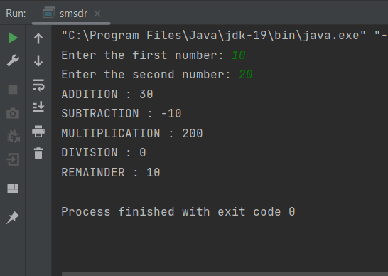
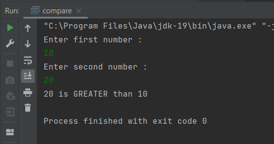
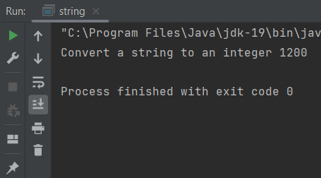
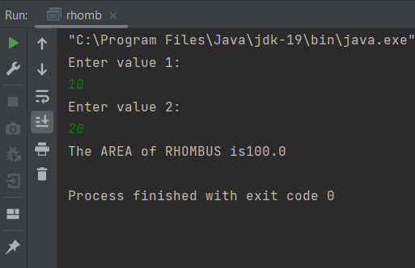
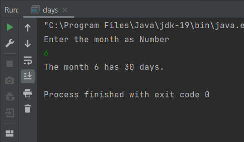
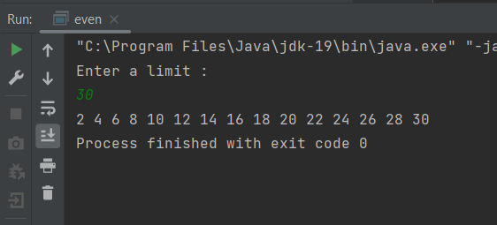
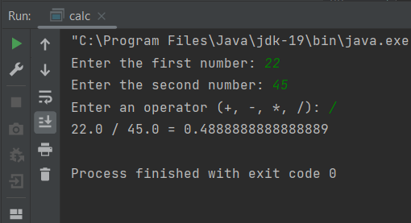
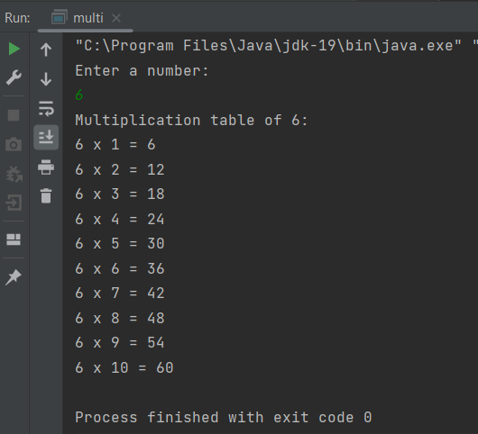

# Java-Assignment
## 1.Write a Java program to print the sum, multiply, subtract, divide and remainder of two numbers.
### PROGRAM :
```
import java.sql.SQLOutput;
import java.util.*;
public class smsdr{
    public static int add(int a,int b){
        return a + b;
    }
    public static int sub(int a,int b){
        return a - b;
    }
    public static int mul(int a, int b){
        return a * b;
    }
    public static int div(int a,int b){
        return a / b ;
    }
    public static int rem(int a,int b){
        return a%b;
    }

    public static void main(String[] args){
        Scanner output = new Scanner(System.in);
        System.out.print("Enter the first number: ");
        int num1 = output.nextInt();
        System.out.print("Enter the second number: ");
        int num2 = output.nextInt();

        int Sum=add(num1,num2);
        int Diff=sub(num1,num2);
        int Prod=mul(num1,num2);
        int Quo=div(num1,num2);
        int Rem=rem(num1,num2);

        System.out.println("ADDITION : " + Sum);
        System.out.println("SUBTRACTION : " + Diff);
        System.out.println("MULTIPLICATION : " + Prod);
        System.out.println("DIVISION : " + Quo);
        System.out.println("REMAINDER : " + Rem);


    }
}
```
### OUTPUT :


## 2.Write a Java program to compare two numbers
### PROGRAM :
```
import java.util.*;
public class compare {
    public static void main(String [] args){
        Scanner nums= new Scanner(System.in);
        System.out.println("Enter first number :");
        int num1= nums.nextInt();
        System.out.println("Enter second number :");
        int num2=nums.nextInt();

        if (num1 == num2){
            System.out.println("They are equal");
        }
        else if (num1 > num2) {
            System.out.println(num1+ " is GREATER than " +num2);
        }
        else {
            System.out.println(num2+" is GREATER than "+ num1);
        }
    }
}

```
### OUTPUT :



## 3.Write a Java program to convert a string to an integer.
### PROGRAM :
```
public class string {
    public static void main(String[]args){
        String a="1200";
        int num = Integer.parseInt(a);
        System.out.println("Convert a string to an integer " + num );
    }
}

```
### OUTPUT:

   
## 4.Write a Java Program to find area of rhombus.

### PROGRAM:
```
import java.util.Scanner;

public class rhomb {
    public static void main(String[]args){
        Scanner area=new Scanner(System.in);
        System.out.println("Enter value 1:");
        int num1=area.nextInt();
        System.out.println("Enter value 2:");
        int num2=area.nextInt();
        float areaRH=(num1*num2)/2;
        System.out.println("The AREA of RHOMBUS is" +areaRH);

    }
}

```
### OUTPUT :


## 5.Write a Java program to find the number of days in a month.
### PROGRAM :
```
import java.util.Scanner;

public class days {
    public static void main(String[]args){
        Scanner mon=new Scanner(System.in);
        System.out.println("Enter the month as Number");
        int month= mon.nextInt();
        int days=0;

        switch (month){
            case 1:
            case 3:
            case 5:
            case 7:
            case 8:
            case 10:
            case 12:
                days=31;
                break;
            case 4:
            case 6:
            case 9:
            case 11:
                days=30;
                break;
            case 2:
                System.out.println("Enter the Year : ");
                int year=mon.nextInt();
                if ((year % 4 == 0 && year % 100 != 0) || year % 400 == 0) {
                    days = 29;
                } else {
                    days = 28;
                }
                break;
            default:
                System.out.println("Invalid month.");
                return;

        }
        System.out.println("The month "+month+" has "+days+" days.");

    }
}

```
### OUTPUT :


## 6.Write a Java program to print the even numbers from 1 to 20.
### PROGRAM:
```
import java.util.Scanner;

public class even {
    public static void main(String[]args){
        Scanner input=new Scanner(System.in);
        System.out.println("Enter a limit :");
        int num=input.nextInt();
        for(int i=1;i<=num;i++){
            if(i%2==0){
                System.out.print(i+" ");
            }
        }

    }
}

```
### OUTPUT :


## 7.Write a Java program to create a simple calculator.
### PROGRAM :
```
import java.util.Scanner;

public class calc {
    public static void main(String[] args) {
        Scanner scanner = new Scanner(System.in);
        System.out.print("Enter the first number: ");
        double num1 = scanner.nextDouble();
        System.out.print("Enter the second number: ");
        double num2 = scanner.nextDouble();
        System.out.print("Enter an operator (+, -, *, /): ");
        char operator = scanner.next().charAt(0);
        double result;

        switch(operator) {
            case '+':
                result = num1 + num2;
                break;
            case '-':
                result = num1 - num2;
                break;
            case '*':
                result = num1 * num2;
                break;
            case '/':
                result = num1 / num2;
                break;
            default:
                System.out.println("Invalid operator");
                return;
        }

        System.out.println(num1 + " " + operator + " " + num2 + " = " + result);
    }
}

```
### OUTPUT :


## 8.Write a Java program to print multiplication table of given number.
### PROGRAM :
```
import java.util.Scanner;

public class multi {
    public static void main(String[] args) {
        Scanner input = new Scanner(System.in);

        System.out.println("Enter a number:");
        int number = input.nextInt();

        System.out.println("Multiplication table of " + number + ":");

        for (int i = 1; i <= 10; i++) {
            System.out.println(number + " x " + i + " = " + (number * i));
        }

        input.close();
    }
}

```
### OUTPUT :


